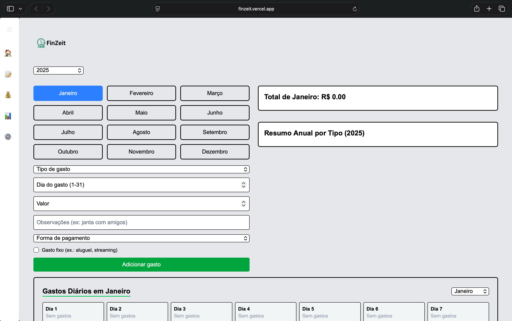
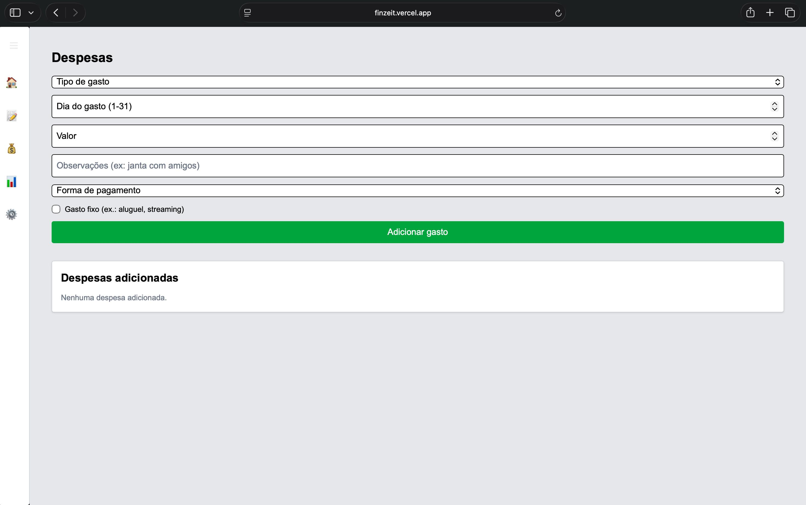
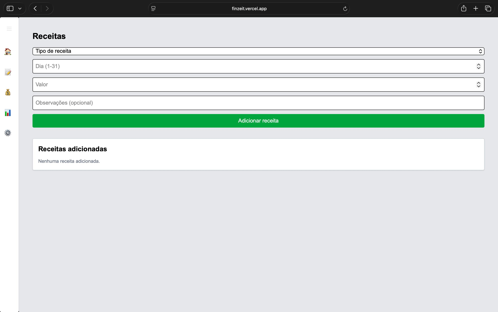

# FinZeit 💰  
A modern personal finance manager built with Next.js, featuring real-time dashboards, category insights, monthly balances, and a clean minimal UI.

### 🔗 Live Demo  
https://finzeit.vercel.app

---

## 🎯 Overview  
FinZeit is a full-stack financial dashboard that helps users manage expenses and income with clarity and precision.  
It features Google authentication, category analytics, monthly breakdowns, dynamic charts, and a clean experience optimized for day-to-day financial control.

---

## 🚀 Features
- 🔐 **Google Authentication (NextAuth)**
- 💸 **Add & remove expenses**
- 🗂️ **Income & expense categories**
- 📅 **Monthly selector with automatic filtering**
- 📊 **Charts for financial insights (Recharts)**
- 📈 **Monthly balance calculation**
- 🎨 **Clean and modern UI (Tailwind CSS)**
- ☁️ **Fully deployed on Vercel**

---

## 🧠 Tech Stack


---

## 🖼️ Screenshots  

### 📊 Dashboard


### 💸 Expenses


### 💰 Income


---

## 📦 Installation & Setup

```bash
git clone https://github.com/felipebborges2/finzeit.git
cd finzeit
npm install
```
---
 
## 🤝 Contributions
Contributions, issues, and feature requests are welcome!

---

## 📄 License
MIT License © 2025 — Felipe Borges

---